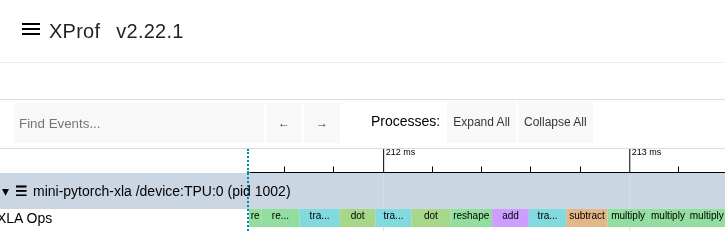

# mini-pytorch-xla

A **real, minimal PyTorch TPU/XLA backend in pure Python**. PyTorch owns the
`Tensor`, autograd, and optimizer; this project only provides the **device and the
op lowering** — a `torch.Tensor` subclass whose `__torch_dispatch__` intercepts
every **aten** op and lowers it to **StableHLO** that runs eagerly on the TPU via
**libtpu's PJRT C API (ctypes)**. No `torch_xla`, no `jax`.

```
  a real torch.nn model  →  aten op  ──__torch_dispatch__──►  StableHLO  ──►  TPU
       (PyTorch autograd + torch.optim drive it)        (ops.py)        (pjrt.py / libtpu)
```

This is the Python-level analogue of how PyTorch/XLA works: torch_xla intercepts
ops with a C++ dispatch key and lowers them to XLA; here `__torch_dispatch__` is the
interception point and we emit StableHLO. Because autograd runs *above*
`__torch_dispatch__`, we implement **only forward ops** — the backward pass is
PyTorch's, and its backward formulas re-dispatch through us, so backward also runs
on the TPU. Composite ops we don't implement are expanded by PyTorch's **core-aten
decompositions** into the primitives we do.

## It runs unmodified `torch.nn`

```python
import torch, torch.nn as nn, torch.nn.functional as F
from mini_pytorch_xla import backend as xb

model = nn.Sequential(nn.Linear(4, 16), nn.ReLU(), nn.Linear(16, 2))
xb.to_xla_(model)                                  # params -> TPU  (like model.to(xla))
opt = torch.optim.AdamW(model.parameters(), lr=1e-3, foreach=False)

x = xb.to_xla(torch.randn(8, 4))
loss = F.mse_loss(model(x), xb.to_xla(torch.zeros(8, 2)))
loss.backward()        # PyTorch autograd -> aten backward ops -> StableHLO on TPU
opt.step()             # real torch.optim, in-place ops lowered to TPU
```

A full char-level transformer (real `nn.Embedding`/`nn.LayerNorm`/`nn.Linear`/
`F.softmax`, `torch.optim.AdamW`) trains on a single TPU:

```
$ python examples/train_torch.py --steps 200
real torch.nn transformer on mini-pytorch-xla | TPU | 0.29M params | vocab 65
PyTorch owns autograd+optimizer; every aten op lowered to StableHLO on the TPU.
Step     0 | Loss: 4.3403
Step    40 | Loss: 3.3720
Step   100 | Loss: 2.8965
Step   199 | Loss: 2.5965
```

## How it works

- **`pjrt.py`** — a ctypes client over `libtpu.so`'s PJRT C API: model the whole
  `PJRT_Api` function table, `from_host`/`compile`/`execute`/`to_numpy`, a
  hand-serialized `CompileOptionsProto`, and a forced row-major read-back layout.
- **`hlo.py`** — StableHLO type strings + a compile/execute cache (keyed by program
  text, so a repeated op compiles once).
- **`ops.py`** — buffer-level StableHLO lowerings (`add`, `dot_general`, `reduce`,
  `transpose`, `broadcast_in_dim`, `select`, one-hot `gather_rows`, …). No autograd.
- **`backend.py`** — `XLATensor(torch.Tensor)` wrapper subclass + `__torch_dispatch__`
  router + an aten→ops registry, plus `to_xla` / `to_cpu` / `to_xla_`. Forward
  primitives + a few fused ops (`addmm`, `embedding`) + in-place ops (so real
  `torch.optim.AdamW` runs); everything else goes through core-aten decompositions.
- **`profiler.py`** — device identity, HBM stats, on-device op timing, throughput.

## What maps to real PyTorch/XLA

| PyTorch/XLA (C++) | mini-pytorch-xla (Python) |
|---|---|
| dispatch-key interception of aten ops | `__torch_dispatch__` on a tensor subclass |
| lowering_context node → HLO | `ops.py` aten handler → StableHLO |
| `torch_xla/csrc/runtime` PjRt client | `pjrt.py` (ctypes over libtpu) |
| `model.to(xm.xla_device())` | `xb.to_xla_(model)` |
| autograd & `torch.optim` (PyTorch's) | autograd & `torch.optim` (PyTorch's — unchanged) |

The one deliberate simplification: **eager, no graph fusion** (one StableHLO program
per aten op, cached). Real PyTorch/XLA traces a whole step into one HLO graph and
lets XLA fuse it; we keep every op's lowering visible and self-contained.

## How a program reaches the TPU

The key thing to understand up front: **the program (code) and the tensors (data)
travel by two completely separate paths**, and they only meet at execute time.

### What "the program" is

In this backend there's no one big program — **each aten op becomes its own tiny
StableHLO module**. When `__torch_dispatch__` intercepts, say, a matmul, `ops.py`
builds a text module:

```mlir
module {
  func.func public @main(%a: tensor<4x5xf32>, %b: tensor<5x6xf32>) -> tensor<4x6xf32> {
    %r = "stablehlo.dot_general"(%a, %b) {...} : (...) -> tensor<4x6xf32>
    return %r : tensor<4x6xf32>
  }
}
```

That **string** is "the program." Transferring it to the TPU is two steps:
**compile+load** (the focus here), then **execute**.

### Step 1 — the program crosses the C boundary (`pjrt.compile`)

The StableHLO text is wrapped in a `PJRT_Program` struct and handed to libtpu through
the PJRT C API:

```python
code = stablehlo_text.encode("utf-8")          # the program, as bytes
prog.code      = <pointer to code>;  prog.code_size = len(code)
prog.format    = b"mlir";            prog.format_size = 4   # "this is StableHLO MLIR"
a.program          = &prog
a.compile_options  = <6-byte CompileOptionsProto>   # num_replicas=1, num_partitions=1
self._raw_call("PJRT_Client_Compile", a)        # call into libtpu
```

Mechanically: `PJRT_Client_Compile` is one function pointer in the `PJRT_Api` table
modeled in ctypes; calling it is `fn(&args)` where `args` carries a **pointer + length**
for the program bytes and the format tag `"mlir"`. So the program crosses the
Python↔C boundary as nothing more than `(char* code, size_t code_size, char* "mlir")`.

### Step 2 — libtpu compiles it and loads it onto the device

Inside `PJRT_Client_Compile`, libtpu does the heavy lifting **on the host CPU**:

1. Parses the StableHLO MLIR text.
2. Runs the **XLA TPU compiler pipeline**: StableHLO → MHLO → HLO →
   optimization/layout/fusion → **TPU machine code** (the actual TensorCore program).
3. **Loads that binary into the TPU runtime** — this is the actual "transfer to the
   TPU": the compiled program is placed in device program memory / registered with the
   on-device runtime so it's ready to dispatch.
4. Returns a `PJRT_LoadedExecutable*` handle (wrapped as `Executable`).

So "transferred to the TPU" really means: **host-side compilation produces a device
binary, and that binary is loaded onto the chip.** After `compile` returns, the program
is resident on the TPU; nothing about it needs to cross again.

### Step 3 — compile once, reuse forever (`hlo.run`)

Compilation is the expensive part (hundreds of ms), so the `Executable` is **cached
keyed by the exact program text**:

```python
exe = _EXE_CACHE.get(module_text)
if exe is None:
    exe = pjrt.client().compile(module_text); _EXE_CACHE[module_text] = exe
return exe.execute(inputs)
```

Because the module text encodes the op *and* the input shapes/dtypes, every training
step after the first reuses step 0's loaded executables — step 0 compiles ~all the ops,
later steps just dispatch. (That's why the op profile shows steady ~160 µs/op: that's
execute, not compile.)

### Step 4 — the data path (separate)

The tensors never travel with the program. `pjrt.from_host` streams a numpy array to
TPU HBM via `PJRT_Client_BufferFromHostBuffer`, returning an opaque `PJRT_Buffer*`
**handle** that lives on the device. The program and the data are now both on the chip,
independently.

### Step 5 — execute binds program + data (`pjrt._execute`)

`PJRT_LoadedExecutable_Execute` is where they meet:

```python
in_arr = (c_vp * n_in)(*[b._h for b in inputs])   # array of device buffer HANDLES
a.executable             = exe._h     # the loaded program on the TPU
a.argument_lists         = &in_arr    # its input HBM buffers (by handle)
a.output_lists           = &out_arr   # where output handles come back
a.device_complete_events = &complete
self._raw_call("PJRT_LoadedExecutable_Execute", a)
self._await(complete[0])              # block until the TPU finishes this op
```

**Only handles cross here** — no tensor bytes. We pass the executable handle + input
buffer handles; libtpu's runtime dispatches the already-loaded program to the
TensorCore with those HBM inputs, writes outputs to new HBM buffers, and signals a
`PJRT_Event`. We `_await` it so the op is synchronous (which is what makes the eager
op-timeline profile faithful). Outputs stay in HBM as handles until something calls
`to_numpy` (`PJRT_Buffer_ToHostBuffer`).

### The whole picture

```
program path (once per unique op):
  StableHLO text ──PJRT_Client_Compile──► [libtpu: XLA TPU compiler → TPU binary
                                           → loaded into device runtime] ──► Executable handle
                                                                   (cached by program text)
data path (per call):
  numpy ──BufferFromHostBuffer──► HBM buffer handle

execute:
  Executable handle + input buffer handles ──LoadedExecutable_Execute──►
       TPU runs the loaded program on the TensorCore ──► output handles + completion event
```

This is exactly the mechanism real PyTorch/XLA uses — the same `PJRT_Client_Compile` /
`Execute` calls into the same libtpu. The only difference is granularity: torch_xla
traces a whole training step into **one** HLO graph and compiles that once; here each
aten op is its own StableHLO module, so you can see every program go down the wire.

## Is the backend "registered"? (the pure-Python limit)

Two ways to add a backend to PyTorch:

1. **A registered device** (a `torch.device('tpu')` via the PrivateUse1 key, like
   torch_xla / torch_npu) — so `cpu_tensor.to('tpu')` and `tensor.device.type=='tpu'`
   work. This requires a **C++ `DeviceGuardImpl` + allocator** registered for the
   device. We tried it (`rename_privateuse1_backend("tpu")` + the subclass on the
   `tpu` device): tensors then report `device='tpu:0'` and forward ops work — but the
   **autograd backward pass crashes** (`PyTorch is not linked with support for tpu
   devices`), because the engine instantiates a C++ DeviceGuard for the tensor's
   device and PrivateUse1 has none. That C++ shim is the one piece a pure-Python
   project cannot provide.

2. **A tensor-subclass + `__torch_dispatch__`** (what this does) — the *pure-Python*
   registration mechanism, the same one functorch / quantization / tracing modes use.
   It intercepts every aten op (forward and autograd-emitted backward) and works with
   full autograd + `torch.optim`. The tensor reports `device='cpu'`, so entry is
   `to_xla(t)` / `to_xla_(model)` rather than `t.to('tpu')`.

So: the **op interception is genuinely registered** with PyTorch's dispatcher; the
**device name** is the only thing missing, and adding it needs ~50–100 lines of C++.
Everything else — Tensor, autograd, optimizer — is real PyTorch.

## Run it

```bash
pip install -r requirements.txt          # numpy + libtpu (a TPU VM); torch (CPU build)
python tests/probe_add.py                # PJRT foundation: a+b on the TPU
python tests/test_ops.py                 # StableHLO op numerics vs numpy
python tests/test_backend.py             # real torch.autograd through dispatch == cpu autograd
python examples/train_torch.py --steps 200
python examples/profile_proof.py         # device identity + HBM + op profile + host/device accounting
```

`profile_proof.py` shows that one full `torch.nn` + autograd + AdamW step is **N TPU
executes with 0 mid-step host readbacks** — i.e. the entire forward, backward, and
optimizer ran on the TPU, not on the host.

`train_torch.py --profile <logdir>` writes an xprof `xplane.pb` of the on-device op
timeline (pure-Python, no torch_xla); inspect it with `xprof -l <logdir>`. See profiler
screenshot:



## Scope / limitations (intentional)

- **Eager**, one StableHLO program per aten op; per-op dispatch + device sync.
- f32 + bf16-matmul (TPU MXU default); single device; no collectives.
- relu (not erf-gelu) and dropout=0 in the example, to stay within the op set.
- embedding is one-hot @ table (avoids gather/scatter); token ids stay on host.
- ~40 aten primitives implemented; composites handled by core-aten decompositions.
- A real builder (MLIR Python bindings) would be safer than text emission, but isn't
  available without pulling in jaxlib/torch_xla or heavy MLIR wheels — so we emit
  StableHLO text and keep the project dependency-free.
